# teamEvolver 深度解读：算法原理与使用指南

> 调研日期：2026-07-28
> 仓库：https://github.com/leoriczhang/teamEvolver
> 定位：面向 Agent 团队的**技能进化流水线**——把真实 session 沉淀为可复用、可同步、可验证的团队 `SKILL.md` 资产
> 技术栈：Python 3.10+ / FastAPI 服务端 + React + TypeScript 控制台，MIT 许可证
>
> 本文基于**源码分析**而非仅 README。所有阈值、prompt、状态机、key 布局均来自实际代码。文末附有"代码实际做了什么 vs README 措辞"的诚实说明。

---

## 一、一句话定位与核心问题

teamEvolver 要解决的不是"让 Agent 记住更多信息"，而是**建立一条从真实 session 到团队能力的安全流水线**：

- 团队里每个人、每台机器、每个 Agent 的使用经验是分散的；
- 把它们集中采集、判断价值、（离线）聚合成候选技能、**回放验证**、版本化发布，最终通过共享存储 + 本地同步回流到 Agent 原生技能系统。

与记忆库（OpenViking / ReMe）最大的区别：teamEvolver 的产物是 **`SKILL.md`（可执行的团队 SOP）**，且发布前有**真实回放验证门控**，而不是把内容塞进向量库供召回。

---

## 二、端到端流水线（Pipeline 全景）

```mermaid
flowchart LR
    A[Hermes on_session_end] -->|push_session.py| B[POST /ingest_session]
    B --> C[SessionValueClassifier<br/>valuable / chitchat]
    C -->|chitchat| D[save_skipped 归档]
    C -->|valuable| E[save_queued 队列]
    E --> F[_schedule_evolve_trigger<br/>触发外部 evolve server]
    F -.离线聚合/脱敏/去重.-> G[candidate_skills 候选技能]
    G --> H[ValidationWorker]
    H -->|replay 关键词启发式| I1[_score_replay_output]
    H -->|truereplay 真实 A/B| I2[True Replay LLM 裁判]
    I1 --> J{通过?}
    I2 --> J
    J -->|accept| K[publish 到 team 空间]
    J -->|reject| L[rejected]
    K -->|SkillHub push| M[对象存储 team 前缀]
    M -->|sync_skills.py pre_llm_call| N[Agent 本机 SKILL.md 目录]
```



关键分工：

| 阶段 | 组件 | 是否在本仓库 |
|------|------|:---:|
| 采集 | Hermes hook `push_session.py` → `POST /ingest_session` | ✅ |
| 价值分类 | `session_filter.SessionValueClassifier` | ✅ |
| 会话存储 | `session_store.SessionStore` | ✅ |
| **聚合/脱敏/去重生成候选** | 外部 **evolve server**（`_schedule_evolve_trigger` 只负责触发） | ❌ 未随仓库发布 |
| 验证 | `validation.ValidationWorker` + `true_replay.py` | ✅ |
| 发布/回滚/版本 | `skills.hub.SkillHub` + `skills.registry` | ✅ |
| 同步回 Agent | Hermes hook `sync_skills.py` | ✅ |

> ⚠️ **重要事实**：候选技能的"跨人语义聚合 + 脱敏 + 去重"逻辑**不在本仓库**。本仓库负责触发一个外部 `evolve server`，由它写回 `candidate_skills/`。因此 README 里描述的"聚合、脱敏、去重"是**设计意图**，本仓库落地的是**采集 + 验证 + 发布治理**这三段。

---

## 三、算法原理详解

### 3.1 采集入口：`POST /ingest_session`（`proxy/routes.py:860`）

处理顺序（源码逐行）：

1. `_check_ingest_api_key(request)`：校验 `EVOLVE_INGEST_API_KEY`（若配置）。
2. `_read_limited_json_body`：读入 session JSON（有体积上限）。
3. 补齐 `session_id`、`user_alias`。
4. **同步**调用 `SessionValueClassifier.classify(session)` 得到 `value_judge`。
5. 写入 `session["value_judge"]`、`ingested_at`。
6. 分流：
   - `decision != "valuable"` → `session_store.save_skipped(session)`，返回 `status="skipped"`；
   - `decision == "valuable"` → `session_store.save_queued(session)`，随后 `owner._schedule_evolve_trigger()` 异步触发外部 evolve server，返回 `status="queued"`。

即：**价值分类是进入进化流水线的唯一闸门**，chitchat 直接归档不进队列。

### 3.2 价值分类器 `SessionValueClassifier`（`session_filter.py`）

这是"值不值得进化"的第一道判断。**注意它只有 valuable / chitchat 一个轴，没有 skill-vs-memory 的路由**。

**LLM 分类（`classify()`，line 167）** 的 system prompt（逐字）：

```
You classify whether a completed agent session should enter a
skill-evolution pipeline. Do not classify by keyword matching.
Return JSON only. Use decision='valuable' for sessions that reveal
reusable workflows, non-trivial tool usage, or transferable problem
solving. Use decision='chitchat' for greetings, trivial Q&A, or
sessions with no reusable procedure.
Schema: {"decision":"valuable|chitchat","confidence":0..1,"reason":"short reason"}
```

- `max_tokens=512`，`temperature=0`（确定性）。
- 超时 `_DEFAULT_CLASSIFIER_TIMEOUT_SECONDS = 60`，超时或 LLM 不可用则回退启发式。

**启发式回退 `heuristic_classify_session`（line 82）** 决策树：

| 条件 | 结果 |
|------|------|
| 无用户文本 | chitchat, conf 0.85 |
| `tool_call_count > 0` 或用到过 skill | valuable, conf 0.75 |
| 首条用户文本长度 ≥ 80，或 turn 数 ≥ 2 | valuable, conf 0.65 |
| 其它 | chitchat, conf 0.6 |

设计意图：**"用过工具 / 有实质多轮"≈ 有可复用流程**，是廉价而稳健的兜底。

### 3.3 会话存储 `SessionStore`（`session_store.py`）

- 用对象存储抽象持久化，两个桶概念：`save_queued`（待进化队列）与 `save_skipped`（归档）。
- session 元信息由 `_session_meta` 抽取：`session_id / title / user_alias / interaction_turns / tool_call_count` 等。
- `_first_user_text` 兼容两种会话结构（`turns[].prompt_text` 或 `messages[].role==user`）。
- **重要**：`session_prefix()` 返回 `""`，即**会话在团队内是共享池**（不按个人隔离），这样外部 evolve server 才能看到跨人共性。技能资产才区分个人/团队（见 3.6）。

### 3.4 验证状态机 `ValidationWorker` / `ValidationStore`（`validation/`）

候选技能进入验证队列后走一个显式状态机：

```
pending ──> evaluated（非终态）──> published
                              └──> rejected
```

`ValidationStore` 的 key 布局（对象存储前缀）：

```
validation_jobs/          # 待验证 job
candidate_skills/         # 外部 evolve server 写入的候选
validation_results/       # 打分结果
validation_evaluations/   # 评估明细
validation_decisions/     # 最终决策
human_review/             # 需人工评审
```

`ValidationWorker.run_once`（`worker.py:276`）三个前置守卫：

1. `_validation_enabled` = `validation_enabled AND sharing_enabled`（两个开关都要开）。
2. `_quota_available`：受 `validation_max_jobs_per_day` 限流。
3. `_is_idle`：`validation_idle_after_seconds` 内无新 session 才跑（避免干扰在线负载）。

### 3.5 两种验证模式（核心算法差异）

teamEvolver 有**两套评分器**，由 `validation_mode` 决定（默认 `"replay"`）。

#### 模式 A：`replay`（默认，关键词启发式）

`_score_replay_output`（`worker.py:92`）——**纯文本、无真实执行**：

| 输出 | 得分 |
|------|:---:|
| 空输出 | 0.0 |
| 命中 failure-marker（失败标记字符串） | 0.25 |
| 其它 | 0.75 |

接受条件：`candidate_mean >= threshold(=min_score, 默认 0.75)` **且** `candidate_mean > baseline_mean`。

> 这是**廉价冒烟**：只判断"候选是否产出非空且不含失败标记"，并不真的比谁执行得更好。README 里"用真实轨迹验证"指的是模式 B，默认模式并不满足这个描述。

#### 模式 B：`truereplay`（真实 A/B 回放，`true_replay.py`）

在**隔离沙盒**中真的把任务跑两遍：**baseline 分支（无候选技能）** vs **candidate 分支（注入候选技能）**，两条分支各自产出真实工具轨迹，再用 LLM 当裁判打分并比较效率。

- 为两条分支各创建临时 `HOME` / `HERMES_HOME`，**不污染真实 Agent 配置**；本地 checkout 可用 `HERMES_ORIGIN` 指定源码。
- 任务未完成时，**裁判反馈作为下一轮用户消息**在同 session 内继续交互（多轮）。

**裁判 `judge_branch`（line 449）** system prompt（逐字）：

```
You are a strict evaluator of an AI agent's execution TRACE.
Judge whether the task was ACTUALLY accomplished via the tools,
not whether the final text sounds plausible. Score three numbers
in [0,1]: task_completion, tool_correctness, overall. Also return
success (bool) and feedback (short string).
```

- `temperature=0`。
- **成功判定**（line 517）：`success = bool(data.success) AND task_completion >= 0.75`。

**效率比较 `compare_efficiency`（line 542）**：对三项指标做归一化增益后取均值：

```
gain(metric) = (baseline_value - candidate_value) / max(1, baseline_value)
efficiency_score = mean(gain(interaction_turns), gain(tool_call_count), gain(total_tokens))
```

优先级（越少越好）：
1. **交互轮次** interaction_turns
2. **工具调用次数** tool_call_count
3. **Total tokens**（同时保留 input/output/cache/reasoning 明细）

**最终接受判据 `evaluate_job`（line 594，默认 `min_score=0.75, tolerance=0.15, max_interactions=4, timeout=600`）**：

```
quality_ok   = candidate 质量达标（task_completion / overall 满足 min_score 相关约束）
accepted     = quality_ok
               AND (candidate_overall >= baseline_overall OR efficiency_score > 0)
               AND efficiency_score >= -0.10      # 效率不能明显倒退
```

即：**质量不降 + （质量不劣于 baseline 或 效率有正增益）+ 效率不明显倒退** 三者同时成立才接受。这保证发布的技能"要么让任务做得更好，要么让路径更短"，且绝不显著变慢变贵。

### 3.6 技能资产模型（`skills/`）

**`SKILL.md` schema（`frontmatter.py`）**：

- 必填：`name`、`description`；可选：`category`、`metadata`。
- `id = sha256(name)[:12]`（名字决定 id）。
- `METADATA_NAMESPACE = "teamEvolver"`；核心 frontmatter key 集合 `{name, description, metadata, category}`，其余进 `_extra_frontmatter` 原样保留。
- 支持 `disable-model-invocation` 过滤（可标记某技能不让模型自动调用）。

**版本与回滚（`registry.py`）**：

- `SkillIDRegistry` 记录每个技能的单调递增版本号。
- 历史封顶 20 条（`history capped 20`）。
- 动作：`create` / `push` / `delete` / `rollback:v{n}`。

**同步与作用域（`hub.py`）**：

- `push_skills`：基于内容 **SHA 变更检测**，只推变化的技能。
- `rollback_skill`：**append-only**（回滚也是新写一条，不抹历史）。
- 个人空间 key 前缀 `peers/{customer_id}/`，团队空间用裸 key → **靠 key 前缀做隔离**。
- `session_prefix() == ""`：会话池团队共享（呼应 3.3）。

**推送质量门（`stats.py`）**：

```
effectiveness = positive_count / inject_count   # 默认 0.5
```

推送时过滤规则：`inject_count >= sharing_push_min_injections`（默认 5）**且** `effectiveness < sharing_push_min_effectiveness`（默认 0.3）的技能 → **被过滤掉不推**。即"被注入够多次、但正反馈率太低"的技能不许污染团队空间。

**技能注入 prompt（`prompt.py`）**：

- 以 `<available_skills>` XML 目录形式注入 Agent 上下文，**没有 per-request 向量召回**，由模型自己从目录里选。
- `max_chars` 默认 30000（目录预算）。

**归因（`attribution.py`）**：

- 把 tool_calls 映射到被 read / modified 的技能，得出"哪些技能被本次 session 用到了"。
- `_drop_failed_hermes_skill_writes`：丢弃失败的技能写操作，**防止从假阳性中学习**。

### 3.7 存储抽象（`storage/`）

统一 4 方法契约：`get_object / put_object / delete_object / iter_objects`，外加 `peer_key_prefix(customer_id)`。

两个后端：
- **本地对象存储**（默认，开箱即用）。
- **`OpenVikingObjectStore`**：走 REST（`POST /api/v1/content/write`、`GET /content/read`、`DELETE /fs`、`GET /fs/ls`）。`_VIKING_ROOT_PREFIX = "teamEvolver"`；技能落在 `viking://resources/teamEvolver/skills/<name>/`。

### 3.8 服务与鉴权（`proxy/`）

关键 endpoint：

| 方法 | 路径 | 作用 |
|------|------|------|
| POST | `/ingest_session` | 采集入口（核心） |
| GET | `/status` `/health` `/healthz` `/storage/status` | 健康与看板 |
| GET | `/validation/candidates/*` | 候选查询 |
| POST | `/validation/candidates/{id}/validate` | 管理员触发验证/发布 |
| POST | `/internal/reload-skills` | 内部重载技能 |
| — | 认证相关 endpoint | 登录/会话 |

**三层鉴权**：
1. **控制台 cookie**：`teamEvolver_console_session`，TTL 24h。
2. **管理员门**：`_require_admin_user`（发布等敏感操作）。
3. **采集 API Key**：`EVOLVE_INGEST_API_KEY`（保护 `/ingest_session`）。

### 3.9 Hermes 集成（`integrations/`，两个 shell hook）

| Hook | 触发时机 | 行为 |
|------|----------|------|
| `push_session.py` | `on_session_end` | **只读**读取 Hermes `state.db`，折叠 turns，`POST /ingest_session`；按 `session_id` **幂等**（重复不会重复入队） |
| `sync_skills.py` | `pre_llm_call` | 拉取团队技能到本机；节流 `DEFAULT_MIN_INTERVAL_SECONDS=60`；用 `flock` 文件锁防并发 |

设计要点：采集是**会话结束后异步上报**，不阻塞对话；同步是**每次 LLM 调用前带节流的拉取**，保证技能新鲜又不打爆存储。

---

## 四、配置项与默认值（`config.py` / `defaults.py`）

| 配置 key | 默认值 | 说明 |
|----------|--------|------|
| `validation_mode` | `"replay"` | 验证模式：`replay`（关键词启发式）/ `truereplay`（真实 A/B） |
| `validation_enabled` | dataclass=True / yaml 默认=False | 验证开关（注意两处默认不一致） |
| `sharing_enabled` | — | 团队共享总开关（验证依赖它） |
| `validation_max_jobs_per_day` | — | 每日验证配额 |
| `validation_idle_after_seconds` | — | 空闲多久才跑验证 |
| `sharing_push_min_injections` | 5 | 推送前最少注入次数 |
| `sharing_push_min_effectiveness` | 0.3 | 低于此有效率不推 |
| `proxy_port` | 30000 | 服务端口（README 部署示例用 52010） |
| `model_name` | `"doubao-seed-evolving"` | 分类/裁判模型（火山 Ark） |
| `llm_api_base` | `https://ark.cn-beijing.volces.com/api/v3` | Ark endpoint |
| `VOLCENGINE_OPENVIKING_ENDPOINT` | `https://api.vikingdb.cn-beijing.volces.com/openviking` | OpenViking 默认服务地址 |
| `CONFIG_DIR` | `~/.teamEvolver` | 本机配置目录 |

True Replay 评估默认：`min_score=0.75`、`tolerance=0.15`、`max_interactions=4`、`timeout=600`、效率地板 `-0.10`。

---

## 五、使用方法

### 5.1 网络代理（内网环境）

```bash
export http_proxy="http://sys-proxy-rd-relay.byted.org:8118"
export https_proxy="http://sys-proxy-rd-relay.byted.org:8118"
export no_proxy="localhost,.byted.org,127.0.0.0/8,::1"   # 视环境补全
```

### 5.2 Server 端：部署 teamEvolver

```bash
export TEAMEVOLVER_HOST="<server-ip-or-hostname>"

git clone https://github.com/leoriczhang/teamEvolver.git
cd teamEvolver
python -m venv .venv && source .venv/bin/activate
python -m pip install -U pip
python -m pip install -e ".[all]"
npm --prefix web-ui install
npm --prefix web-ui run build

# 关键配置
teamEvolver config service.host 0.0.0.0
teamEvolver config service.port 52010
teamEvolver config skills.enabled true
teamEvolver config skills.dir ./skills
teamEvolver config sharing.enabled true
teamEvolver config sharing.backend viking
teamEvolver config sharing.viking_team_api_key "<team-key>"
teamEvolver config sharing.viking_personal_api_key "<personal-key>"
teamEvolver config sharing.viking_root_prefix "team-skill-evolver"

mkdir -p skills
teamEvolver start --daemon --port 52010
teamEvolver status
curl -fsS "http://127.0.0.1:52010/health"
curl -fsS "http://127.0.0.1:52010/status"
```

控制台：`http://<server-ip>:52010/console`。首次可初始化管理员，默认账号/密码均为 `admin`，**部署后立即修改**。

### 5.3 Client 端：接入 Hermes

```bash
export TEAMEVOLVER_REPO="/path/to/teamEvolver"
export HERMES_HOME="${HERMES_HOME:-$HOME/.hermes}"
export TEAMEVOLVER_URL="http://<server-ip>:52010"
export TEAMEVOLVER_USER="<unique-user-alias-for-this-machine>"

# 安装同步 hook（sync_skills.py，pre_llm_call）
python "$TEAMEVOLVER_REPO/teamEvolver/integrations/hermes_skill_sync/install.py" \
  --hermes-home "$HERMES_HOME" --python python3 \
  --backend service --url "$TEAMEVOLVER_URL" --user "$TEAMEVOLVER_USER"

# 安装采集 hook（push_session.py，on_session_end）
python "$TEAMEVOLVER_REPO/teamEvolver/integrations/hermes_skill/install.py" \
  --hermes-home "$HERMES_HOME" --python python3 \
  --user "$TEAMEVOLVER_USER" --url "$TEAMEVOLVER_URL"

# 首次手动同步一次 + 校验
python "$HERMES_HOME/skills/teamEvolver-sync/sync_skills.py"
hermes hooks list
curl -fsS "$TEAMEVOLVER_URL/status"
```

Hermes 已在运行时，在会话内执行 `/reload-skills` 即可拉到新技能。

### 5.4 True Replay（真实验证）

```bash
# 安装 True Replay 依赖
python -m pip install -e ".[truereplay]"

# 从验证队列回放某个 job
python -m teamEvolver.true_replay --job-id <validation-job-id> --json

# 用本地 JSON 独立回放（dry-run 只打印计划，不真跑）
python -m teamEvolver.true_replay --job-file ./candidate_job.json --dry-run
python -m teamEvolver.true_replay --job-file ./candidate_job.json --json
```

要真正启用真实回放而非默认冒烟，需切模式：

```bash
teamEvolver config validation.mode truereplay
teamEvolver config validation.enabled true
teamEvolver config sharing.enabled true
```

### 5.5 手动经由 API 采集一条 session

```bash
curl -fsS -X POST "http://127.0.0.1:52010/ingest_session" \
  -H "Content-Type: application/json" \
  -H "X-Api-Key: $EVOLVE_INGEST_API_KEY" \
  -d '{
        "session_id": "demo-001",
        "user_alias": "alice",
        "turns": [{"prompt_text": "帮我把 CSV 转成带表头的 Markdown 表格并校验列数"}],
        "metrics": {"interaction_turns": 3, "tool_call_count": 5}
      }'
# 返回 status=queued 表示被判为 valuable 并入队；skipped 表示 chitchat 归档
```

### 5.6 开发

```bash
python -m pip install -e ".[dev,all]"
python -m pytest
npm --prefix web-ui install && npm --prefix web-ui run build
python -m pip install build && python -m build
```

---

## 六、控制台页面

| 页面 | 作用 |
|------|------|
| 进化看板 | 存储连通性、技能数量、候选队列、系统状态 |
| 候选评审 | 检查待验证候选，配合 True Replay 发布前评估 |
| 进化审计 | 技能演进记录 |
| 系统健康 | 服务/存储/关键 API 可达性 |
| 技能管理 | 管理个人/团队技能，支持上传 zip 包 |
| 用户管理 | 用户、角色、个人/团队空间凭据 |
| 模型配置 | 配置验证模型 + 连通性测试 |

---

## 七、诚实说明：代码实际做了什么 vs README 措辞

在阅读源码后，有几处需要如实指出，避免误用：

1. **"聚合 / 脱敏 / 去重"生成候选技能的逻辑不在本仓库。** 本仓库只 `_schedule_evolve_trigger` 触发一个**外部 evolve server**，由它写回 `candidate_skills/`。因此跨人语义聚合、PII 脱敏、去重这三件事在开源代码里**没有可审计的实现**。

2. **默认验证不是"真实轨迹"。** `validation_mode` 默认 `"replay"`，只是"非空且不含失败标记 → 0.75"的关键词启发式冒烟。README 强调的"用真实轨迹验证"对应的是 `truereplay` 模式，需显式开启并装 `.[truereplay]` 依赖。

3. **价值分类只有一个轴（valuable / chitchat）。** 代码里**没有** README 设计原则里说的"先判断可否共享，再判断写成 skill 还是 memory"的路由；skill-vs-memory 的分层判断没有落地。

4. **个人/团队隔离靠 key 前缀，不是强隔离。** `peers/{customer_id}/` 前缀区分作用域；session 本身是团队共享池（`session_prefix()==""`），依赖存储侧权限保证隐私。

5. **两处 `validation_enabled` 默认值不一致**（dataclass True / yaml 默认 False），部署时以实际配置文件为准，建议显式设置。

结论：teamEvolver 落地扎实的是**采集（幂等 hook）+ 价值分类（LLM+启发式兜底）+ 验证治理（状态机 + 两模式评分 + 效率门控）+ 版本化发布（SHA 变更检测 + append-only 回滚 + 推送质量门）**这条治理链；而"跨人聚合成候选"这一步依赖未开源的外部组件。

---

## 八、与记忆库方案的定位差异

| 维度 | teamEvolver | OpenViking / ReMe |
|------|-------------|-------------------|
| 产物 | 可执行的团队 `SKILL.md`（SOP） | 可召回的 memory / context |
| 核心动作 | 采集→验证→发布 team skill | 写入→分层→检索召回 |
| 质量保证 | **发布前真实回放验证 + 效率门控** | 检索准确率 / 分层省 token |
| 分发方式 | 对象存储 + 本机同步 + Agent 原生加载 | 注入上下文 / MCP 召回 |
| 隔离 | 个人 vs 团队（key 前缀 + 推送质量门） | user 命名空间 |

teamEvolver 与 OpenViking 是**互补**关系：OpenViking 可作为 teamEvolver 的对象存储后端（`sharing.backend viking`），teamEvolver 在其上叠加"技能进化 + 验证 + 版本治理"。

---

## 九、参考

- 仓库：https://github.com/leoriczhang/teamEvolver
- 相关：[SkillClaw](https://github.com/AMAP-ML/SkillClaw)（多 Agent skills 进化）、[OpenSpace](https://github.com/HKUDS/OpenSpace)（质量优先 Skill Hub）、[Hermes Agent](https://github.com/nousresearch/hermes-agent)（可选 True Replay 运行时）
- 存储后端：[volcengine/OpenViking](https://github.com/volcengine/OpenViking)
- 关键源码：`proxy/routes.py`（采集入口）、`session_filter.py`（价值分类）、`validation/worker.py` + `true_replay.py`（验证）、`skills/`（技能资产/版本/发布）、`storage/`（存储抽象）、`integrations/`（Hermes hook）
