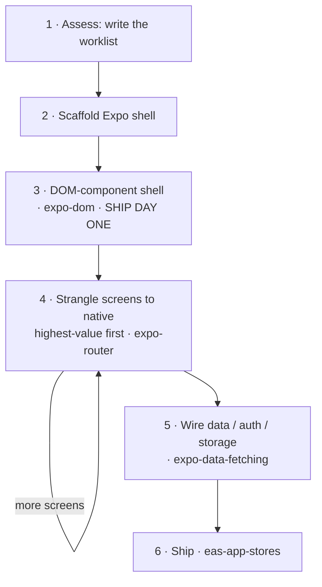

# Web 到原生

一个 web React 应用不是*转换*成原生的 — 不存在转译器。它是*迁移*的，一个屏幕一个屏幕地迁移，就像绞杀榕围绕一棵树生长并慢慢取代它那样：先搭起一个原生外壳，第一天就让整个 web UI 在里面运行，然后按优先级把每个屏幕逐一"绞杀"为原生。本 skill 是组织这项工作的主干；每个步骤都交接给现有的 Expo skill，而不是重新解释一遍。它将 Expo 的 [From Web to Native with React](https://expo.dev/blog/from-web-to-native-with-react) 付诸实践 — 想了解原因请阅读那篇文章。



## 原则

- **迁移，而不是重写。** 绝不大爆炸式一步到位；每一步都要让应用保持可发布状态。
- **第一天就发布。** web UI 在 DOM 组件外壳中运行（第 3 步），在任何东西原生化之前 — 这就是里程碑；之后的所有工作都是打磨。
- **按价值绞杀。** 将热门屏幕原生化；其余留在 webview 里。每个 DOM 屏幕都携带约 2 MB 的 web 运行时 — 这足以成为不把一切都以 DOM 形式发布的理由。
- **原生化意味着重新设计，而不是换皮。** 被"绞杀"的屏幕应该看起来像是 Apple/Google 官方出品的，而不是网页换了层皮。**优先使用 `@expo/ui`** - 它渲染真正的 SwiftUI/Compose，因此体验与操作系统*完全*一致；带样式的 RN 基础组件仅作为自定义布局的回退方案。再加上平台导航（`expo-router`：NativeTabs、大标题）、通过 `@expo/ui` 实现的液态玻璃和原生组件，以及移动 UX（sheet、滑动、触觉反馈）。web→原生的模式映射见 [`./references/native-patterns.md`](./references/native-patterns.md)。如果它仍然感觉像个网站，那你只是做了移植而不是重新设计。
- **通过运行来验证，而不是通过编译。** 编译通过证明不了什么（空白 webview 也能正常编译）。运行每个屏幕 — 但要对照 web 原版判断*内容和行为*，而不是像素（原生化后的屏幕应该看起来更"原生"，而不是完全相同）。
- **编排，而不是重新发明。** 每个步骤都路由到现有的 skill。这里的价值在于*顺序*和*坑* — 逐个惯用法的映射见 [`./references/false-friends.md`](./references/false-friends.md)。

## 以循环方式运行（推荐）

迁移是一个不断重复直到完成的循环，所以第一步是**编写目标（goal objective）并启动它** — 而不是手动逐个打磨屏幕。在 [`./references/run-as-goal.md`](./references/run-as-goal.md) 中为本应用填写目标并展示出来；它**在每次迭代时都会重新读取本 skill**，因此每一轮 `/goal` 都会重新加载 playbook + 工作清单并推进下一个屏幕（它甚至能自举完成评估步骤）。然后用它运行 `/goal` — 或者，如果 harness 无法循环，就将其写入 `migration-goal.md` 并让用户启动。下面的步骤是每次迭代要做的事；只有在不做循环时才手动执行。

## 迁移过程

> **没有可迁移的仓库** - 作为 web 开发者想直接从零构建原生应用？你不需要这些步骤：使用 `expo-router`，并把 [`./references/false-friends.md`](./references/false-friends.md) 打开放在手边，用于查阅 web→原生惯用法映射。下面的一切都假定已有一个现成的 web 应用。

### 1. 评估 → 编写工作清单

阅读仓库并生成 `migration-progress.md`，即迁移其余部分据以逐项勾选的持久工作清单。做两个切分：

- **屏幕 vs 后端。** 页面路由（`page.tsx`）是你要迁移的屏幕；服务器路由（`route.ts`）、ORM 和认证处理器留在服务端。后端只决策一次：保持已部署状态（原生应用变成 HTTP 客户端），或迁移到 EAS Hosting（`eas-hosting`）。
- **为每个屏幕分类**，确定它应如何落地：**原样移植**（展示型 → 以 DOM webview 形式发布）、**立即原生化**（热门，或需要原生手感 — 手势、列表、键盘）、**稍后原生化**，或**混合**（web 子树外包一层原生外壳，例如聊天列表包裹一个 markdown 渲染器）。

阅读时记下框架信号 — RSC 还是客户端、Tailwind/shadcn、数据在哪里获取 — 因为它们决定每个屏幕如何移植（映射见 false-friends；特别是异步 Server Components 必须先拆分为客户端 fetch + 展示型组件才能迁移）。**同时标记第三方服务/SDK** — 浏览器 SDK 无法直接沿用（`false-friends` → *Services & SDKs*）；支付尤其是一个*分叉，而不是替换*（应用内数字商品必须使用通过 RevenueCat 的应用商店内购，约 30% — 而不是 Stripe），这是现在就要做的商业模式决策，而不是等到 App Store 审核时。只有当每个路由都已归类、每个屏幕都已分桶后，工作清单才是可信的。

### 2. 搭建外壳

`create-expo-app`，然后在 Expo Router 中镜像 web 路由 — Next 的目录树几乎 1:1 对应（注意 `[id]/page.tsx` → `[id].tsx`，且路由可能位于 `src/app/` 中）。空白屏幕，每个路由一个。

### 3. 用 DOM 组件装进外壳 — 第一天里程碑

将每个屏幕作为 DOM 组件（按照 `expo-dom` skill 使用 `'use dom'`）带入，由其原生路由渲染，从而在任何东西原生化之前，整个应用就能在手机上运行。预计每个屏幕都需要一些修改 - 解开 Server Components、替换框架导入（`next/link`）、把样式带过来 - 这些在 false-friends 中都有介绍。然后通过运行来验证（见下文）；这个状态本身就可以发布到 TestFlight。

### 4. 按价值将屏幕绞杀为原生

自上而下遍历 `migration-progress.md`。对于每个屏幕，以原生方式*重新设计*它 - 不要移植 web 布局。**优先使用 `@expo/ui`**（真正的 SwiftUI/Compose - 按钮、列表、sheet、选择器、滑块；[`./references/native-patterns.md`](./references/native-patterns.md) 给出了哪种 web 模式对应哪种原生组件），然后是平台导航（`expo-router` - NativeTabs、大标题）和移动 UX（滑动、触觉反馈、惯性/反向滚动）；RN 基础组件仅用于自定义布局。每个惯用法都请查阅 [`./references/false-friends.md`](./references/false-friends.md)。`@expo/ui` 和 DOM 组件都能在 **Expo Go**（SDK 56+）中运行 - 只有*自定义*原生模块才需要 dev build（`expo-dev-client` skill）。对照正在运行的 web 原版验证*内容和行为*（外观应该变得更原生），然后勾选完成。每轮处理一个屏幕，全程应用保持可发布状态。这是对持久工作清单的循环，因此可以无人值守地运行 - 把它交给 goal 循环（[`./references/run-as-goal.md`](./references/run-as-goal.md)）。

### 5. 接入数据、认证和存储

web 数据层在迁移后无法幸存 - 相对路径 fetch、cookie 会话、`localStorage` 和环境变量都会变化（替换方案见 false-friends）。请求和缓存使用 `expo-data-fetching`；如果后端迁移到了 EAS Hosting，则添加 `eas-hosting`。

### 6. 发布

应用商店构建（App Store / Play / TestFlight）使用 `eas-app-stores`，之后的 OTA 推送使用 EAS Update。

## 通过运行来验证，而不是通过编译

绿色的 `expo export` 只证明屏幕能*打包*，不能证明它能*渲染* — 一个屏幕可能构建成功但仍渲染空白或渲染错误。因此在搭完外壳后以及每个屏幕原生化之后，针对同一路由比较两个**正在运行**的应用：

- **Web 原版** — 用 **`agent-browser`**（vercel-labs CLI）采集：`open` 打开路由，`snapshot --json` 获取无障碍树，`screenshot` 截图。
- **原生** — 用 **`argent`** 驱动模拟器：`describe` / `debugger-component-tree` 查看结构，`flow` 在每轮中重放检查。

以**内容和行为**一致为通过标准 — 而不是像素：原生化后的屏幕应该看起来比 web 版*更*原生，绝不应完全相同（DOM 外壳阶段是例外 — 在那里它*就是* web UI，所以应该一致）。手感是原生的一部分，无法通过截图体现 — 对于有过渡动画或手势的屏幕，录制一段短视频，而不仅仅是一张静态图（见 `native-patterns.md` → Feel）。此循环**对其工具有明确主张**：如果未安装 `agent-browser` 或 `argent`，请询问用户并在继续之前安装 — 不要回退到手动截图。完整方案和设置见 [`./references/verify-on-device.md`](./references/verify-on-device.md)。

## 参考资料

- [`./references/false-friends.md`](./references/false-friends.md) — web 惯用法 → 原生对应物 + 各自的坑。步骤 3–5 的查阅手册，也适用于任何需要"忘掉" web 惯用法的 web 开发者。
- [`./references/native-patterns.md`](./references/native-patterns.md) — web UX *模式* → 原生重新设计（`@expo/ui` 优先）。第 4 步的重新设计 playbook，让屏幕感觉像操作系统原生，而不是换皮。
- [`./references/verify-on-device.md`](./references/verify-on-device.md) — 双智能体一致性方案：驱动 web 应用（浏览器智能体）和原生应用（argent），打开同一路由并比较。
- [`./references/run-as-goal.md`](./references/run-as-goal.md) — 一个现成的、迁移专用的 goal objective，用于无人值守地驱动第 4 步（每次迭代都会重新读取本 skill）。
- [Expo — From Web to Native with React](https://expo.dev/blog/from-web-to-native-with-react) — 本 skill 所实施的权威指南。

## 提交反馈
如果你在本 skill 中遇到错误、误导性或过时的信息，请报告以便 Expo 改进：
```bash
npx --yes submit-expo-feedback@latest --category skills --subject "expo-web-to-native" "<actionable feedback>"
```
仅在有具体且可操作的内容可报告时提交。请尽可能包含相关上下文。
如果 AI 智能体反复失败，或者用户不得不接手某个 Expo 任务，请加载 expo-skill-feedback skill 并按照其 eval-candidate 流程操作，而不是复用上面的命令。
