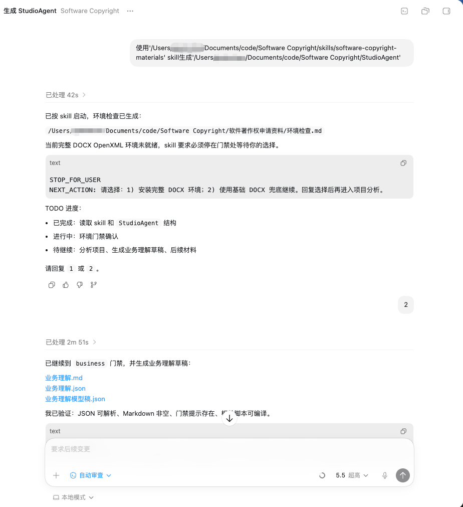
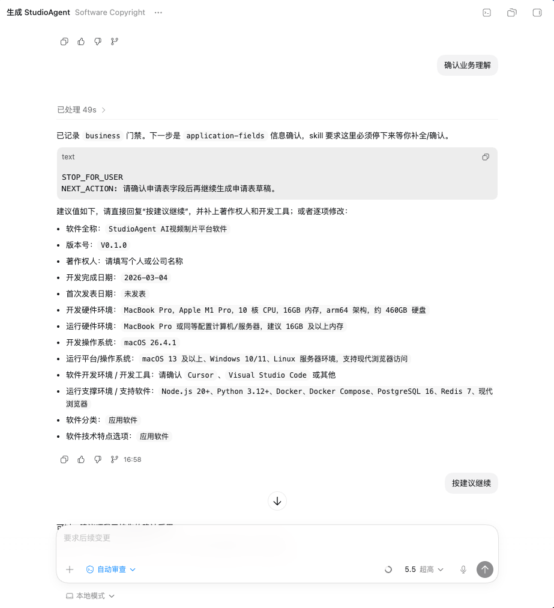
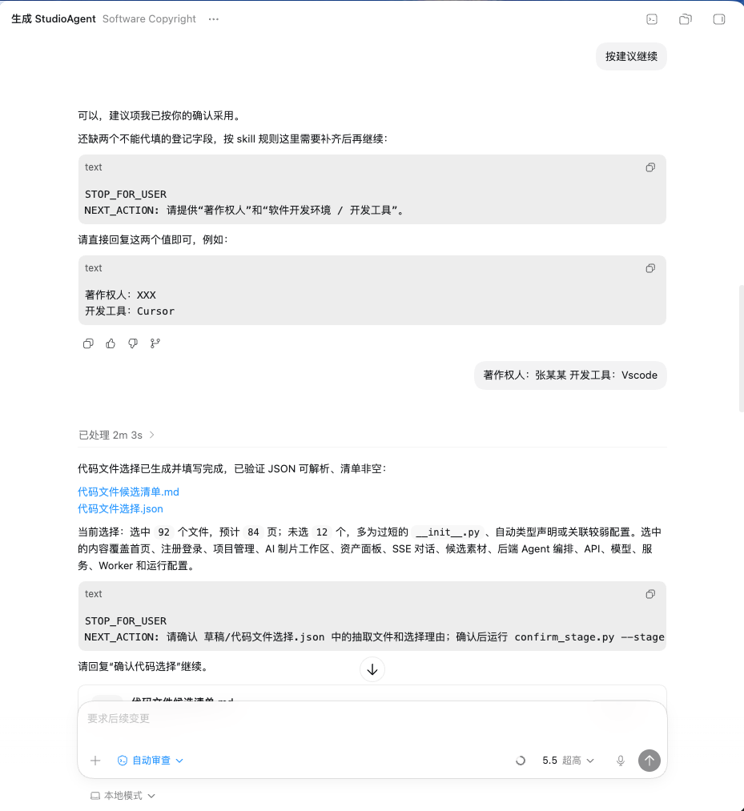
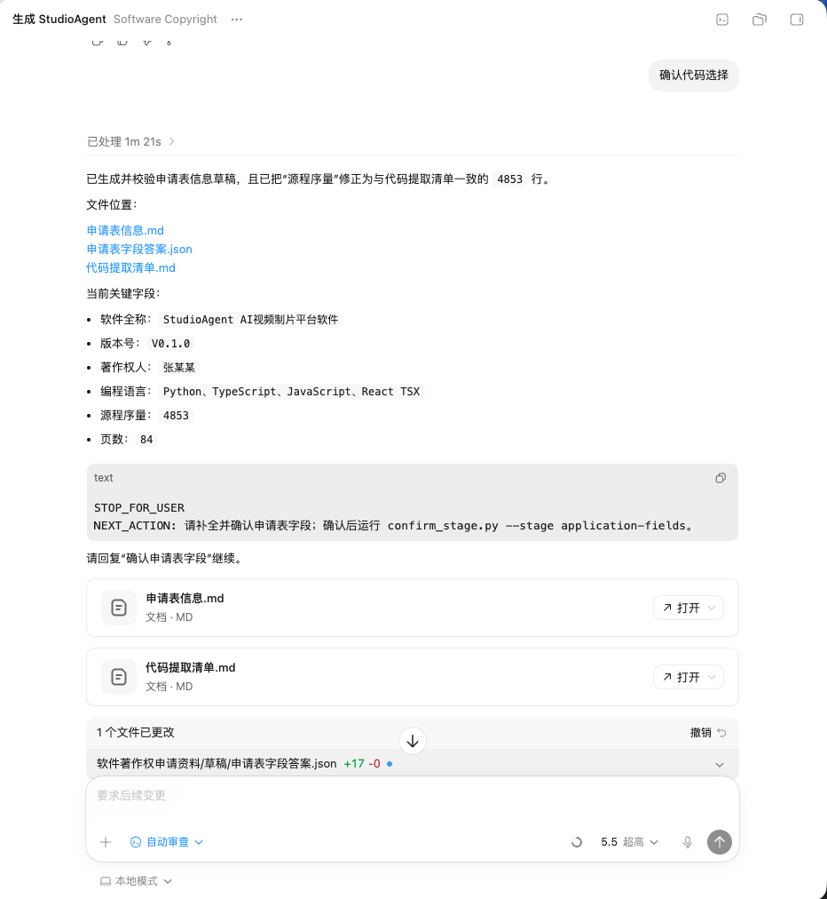
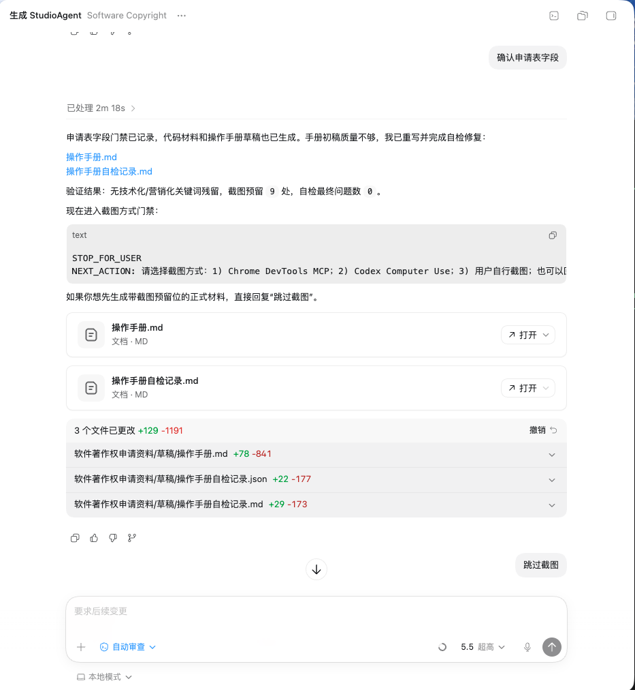
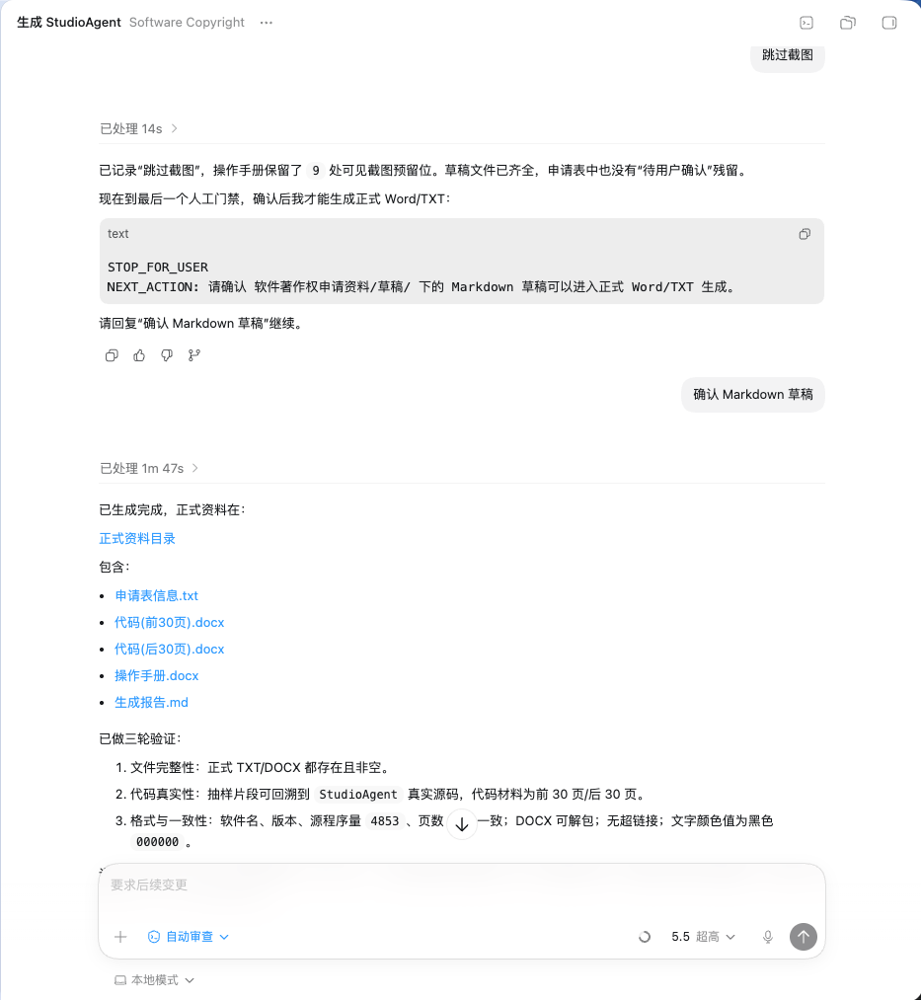
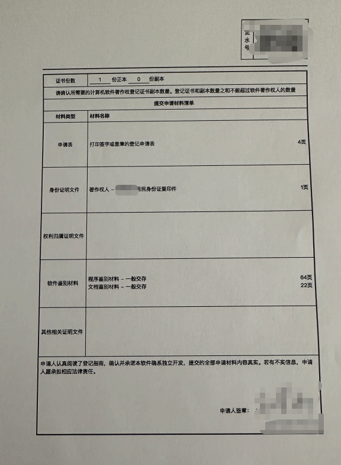

# Software Copyright Materials Skill

这是一个用于生成中文软件著作权申请资料的通用 Skill 仓库，适用于支持本地 Skill 目录机制的 coding agent 软件。

项目地址：https://github.com/Fokkyp/SoftwareCopyright-Skill

真正的 Skill 位于：

```text
software-copyright-materials/
```

安装时不要把仓库根目录当作普通单个 skill 复制。只需将 `software-copyright-materials/` 这个实际 skill 目录放置到你的 coding agent 软件要求的 skill 目录下，即可加载使用。

## 功能概览

> **本项目完全免费。请不要相信任何使用本项目包装出来的付费服务。**

软件著作权申请本身不神秘，真正麻烦的是整理材料：申请表字段要写对，操作手册要像样，代码材料要按规则截取，软件名称、版本号、页数还要保持一致。很多开发者最后会把这件事交给付费代办或资料整理服务，花钱买的往往也只是这些文档整理工作。

这个 skill 的目标很直接：让开发者不用再为整理软著材料额外付费，也不用把项目代码和产品细节交给外部商家来回沟通。把真实项目交给支持该 skill 的代码助手，它会按流程引导你确认关键信息，并在本地生成一整套可检查、可修改、可提交前再导出的软著申请资料。

- **自己生成整套资料**：从项目分析、业务理解、申请表信息、操作手册到代码材料，一套流程跑完，不再依赖外部代办整理文档。
- **从真实源码抽取代码**：代码材料只来自开发者已有项目，禁止 AI 编造源码，适合对材料真实性敏感的开发者。
- **自动处理前 30 页 / 后 30 页规则**：源码足够时按常见鉴别材料要求生成前 30 页和后 30 页；不足 60 页时按规则生成全部代码材料。
- **操作手册不套模板**：先理解项目业务、页面和功能，再写面向审核员的操作说明，避免只有空泛功能列表。
- **申请表字段集中整理**：软件名称、版本号、著作权人、开发环境、运行环境、源程序量、功能说明等字段统一生成到 `申请表信息.txt`，官网填报时可以对照复制。
- **关键节点都让你确认**：业务口径、申请表字段、代码选择、截图方式、最终 Markdown 草稿都会停下来让开发者确认，减少材料写偏的风险。
- **Word/TXT 一键输出**：确认后生成操作手册 DOCX、代码材料 DOCX 和申请表 TXT，文件统一放在 `软件著作权申请资料/正式资料/`。
- **本地生成，资料可控**：默认在当前项目目录生成材料，代码、文档和草稿都留在本地，方便开发者自行审阅、修改和归档。
- **提供完整 demo**：仓库内提供 [`生成demo/软件著作权申请资料/`](生成demo/软件著作权申请资料/)，可以直接点击查看生成后的草稿、正式资料和填报辅助文件。

## 演示截图

| 生成流程 | 生成流程 |
|---------|---------|
|  |  |
|  |  |
|  |  |

## 目录结构

```text
.
├── docs/
│   └── screenshots/
│       ├── demo-1.png
│       ├── demo-2.png
│       ├── demo-3.png
│       ├── demo-4.png
│       ├── demo-5.png
│       ├── demo-6.png
│       └── 著作权申请表.png
├── software-copyright-materials/
│   ├── SKILL.md
│   ├── agents/
│   ├── references/
│   ├── scripts/
│   └── vendor/
└── 生成demo/
    └── 软件著作权申请资料/
        ├── 草稿/
        └── 正式资料/
            ├── 申请表信息.txt
            ├── 软件名称_操作手册.docx
            ├── 软件名称-代码(前30页).docx
            └── 软件名称-代码(后30页).docx
```

## 下载并安装

先获取本仓库。会用 Git 的用户执行：

```bash
git clone https://github.com/Fokkyp/SoftwareCopyright-Skill.git
cd SoftwareCopyright-Skill
```

不会用 Git 的用户可以在 GitHub 页面点击 `Code` -> `Download ZIP`，解压后进入仓库目录。目录中应能看到实际 skill 目录：

```text
software-copyright-materials/
```

按照你的 coding agent 软件文档，找到它要求的 skill 目录，然后复制实际 skill 目录即可：

```bash
AGENT_SKILLS_DIR="<你的 coding agent 软件要求的 skill 目录>"
mkdir -p "$AGENT_SKILLS_DIR"
cp -R software-copyright-materials "$AGENT_SKILLS_DIR/"
```

如果你的 coding agent 支持项目级 skill，也可以把 `software-copyright-materials/` 放到该项目要求的本地 skill 目录中：

```bash
PROJECT_SKILLS_DIR="<你的项目级 skill 目录>"
mkdir -p "$PROJECT_SKILLS_DIR"
cp -R software-copyright-materials "$PROJECT_SKILLS_DIR/"
```

复制完成后，按你的 coding agent 软件要求重启会话、刷新 skill 列表或重新加载配置。

## 运行要求和环境校验

### 必需环境

- **支持 Skill 的 coding agent 软件**：能够从本地 skill 目录加载 `software-copyright-materials/`。
- **Python 3.10+ 和 python-docx**：生成流程依赖 `software-copyright-materials/scripts/` 下的 Python 脚本，用于分析项目、生成草稿、抽取真实代码、校验字段和生成正式资料。
- **可读取的项目源码**：代码材料必须从真实项目中抽取，所以需要在代码助手中打开或指定你的项目目录。

安装 Python 依赖：

```bash
python3 -m pip install python-docx
```

### 可选环境

- **.NET SDK 8.0+**：用于启用更完整的 DOCX OpenXML 生成和校验能力。没有 .NET SDK 也可以继续使用基础 DOCX 兜底生成。
- **Chrome DevTools MCP**：只有在你希望自动截取网页截图时才需要。
- **桌面控制能力**：仅在你的 coding agent 软件支持并且需要操作桌面界面或截图时使用。
- **用户自行截图**：如果没有 MCP 或桌面控制能力，也可以手动把截图放到指定目录，或者直接跳过截图。

### 使用过程中会自动检查吗？

会。每次开始生成资料时，skill 会先运行环境检查，并在当前目录生成：

```text
软件著作权申请资料/环境检查.md
软件著作权申请资料/环境检查.json
```

环境检查会告诉你：

- Markdown 草稿、TXT、基础 DOCX 是否可用。
- 完整 DOCX OpenXML 环境是否可用。
- `.NET SDK` 是否缺失。
- 当前会把材料生成到哪里。

如果完整 DOCX 环境缺失，代码助手会停下来让你选择：

1. 安装完整 DOCX 环境。
2. 使用基础 DOCX 兜底继续。

它不会在你不确认的情况下静默安装依赖。截图也一样，会先让你选择 Chrome DevTools MCP、coding agent 桌面控制能力、用户自行截图或跳过截图；如果你跳过截图，操作手册里会保留可见的截图预留位置。

## 基本使用

安装或加载完成后，在代码助手中打开需要生成软著资料的项目，然后直接说：

```text
使用 software-copyright-materials 生成当前项目的软件著作权申请资料
```

如果你的 coding agent 软件支持手动调用 skill，请按该软件的调用格式选择 `software-copyright-materials`。

代码助手会按流程引导填写信息、确认草稿，并在当前项目目录下生成 `软件著作权申请资料/`。

## 开源协议

本项目采用 [MIT License](LICENSE) 开源。你可以自由使用、复制、修改、分发，也可以基于它继续开发自己的版本。使用者仍需自行核对生成材料是否符合实际项目和官网当前要求。

## 代码材料说明

依据软件著作权申请材料要求，代码鉴别材料应来自申请软件本身。本 skill 不通过 AI 生成项目代码，也不编造不存在的源码内容。

本 skill 的作用是帮助开发者从已有项目中理解业务、选择代码文件、提取前后代码材料，并整理为便于编辑和提交的文档格式。开发者应在提交前自行核对代码材料是否来自真实项目、软件名称和版本号是否与申请表保持一致。

## 官网填报和提交

官方入口：

- 中国版权保护中心：https://www.ccopyright.com.cn/
- 著作权登记系统：https://register.ccopyright.com.cn/login.html
- 法规依据：《计算机软件著作权登记办法》：https://www.gov.cn/zhengce/2002-02/20/content_5724627.htm

官方页面可能会调整，实际填报时以官网当前页面为准。

### 著作权申请表填写示例

著作权申请表按照以下图片填写。



### 申请流程

1. 打开中国版权保护中心官网，进入著作权登记系统。
2. 注册或登录账号，并按页面提示完成实名认证。
3. 进入软件著作权相关业务，选择计算机软件著作权登记申请。
4. 在线填写申请表。可以打开本工具生成的 `正式资料/申请表信息.txt`，把软件名称、版本号、开发完成日期、开发环境、运行环境、功能说明等内容复制到官网对应字段。
5. 上传申请材料。根据官网要求上传 PDF 格式文件和其他证明材料。
6. 核对信息无误后提交申请，并按官网提示查看受理、补正或登记结果。

### 生成文件怎么用

`申请表信息.txt` 是填报辅助文件，用来帮助开发者在官网填写申请表，不是直接上传的申请材料。

`docx` 文件是本地编辑稿，方便开发者在 Word、WPS 或 Pages 中继续修改。提交官网前，请将需要上传的 `docx` 文件导出或另存为 PDF，再按官网要求上传。

实际文件名会包含软件名称。通常需要转换为 PDF 的文件包括：

- `操作手册.docx`
- `代码(前30页).docx`
- `代码(后30页).docx`
- 不足 60 页时生成的全部代码材料

申请人身份证明、权属证明、委托材料等其他文件，请按官网页面要求另行准备并上传。

<p align="left"><sub>友情连接：<a href="https://linux.do/">Linux Do 社区</a> · <a href="https://www.v2ex.com/">V2EX</a></sub></p>
