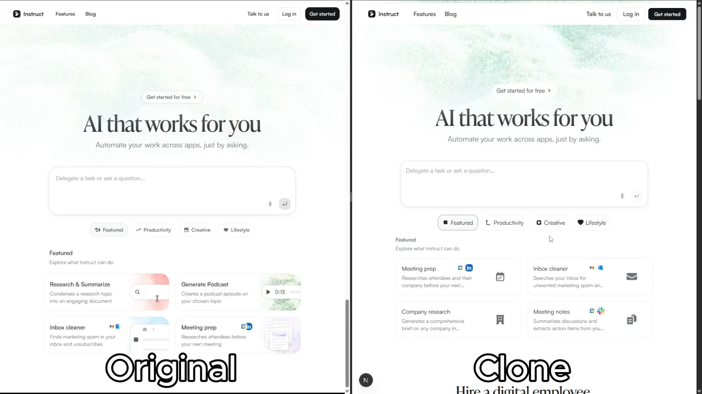
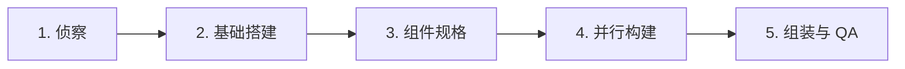

<div align="center">

# AI Website Cloner Template 中文版

### 一条命令，克隆任意网站

只需给你的 AI 编程代理一个 URL，它就会将该网站重新构建成一个简洁的 Next.js 应用。

**推荐使用 [Claude Code](https://docs.anthropic.com/en/docs/claude-code) + Opus 5 以获得最佳效果，同时支持 Codex、Cursor、Gemini 等工具。**

[](https://github.com/JCodesMore/ai-website-cloner-template/generate) [](https://discord.gg/hrTSX5yTpB)

[快速开始](#快速开始) · [观看演示](#演示) · [支持的平台](#支持的平台)

<a href="https://github.com/JCodesMore/ai-website-cloner-template/blob/master/LICENSE"></a> <a href="https://github.com/JCodesMore/ai-website-cloner-template"></a> 

  <a href="https://trendshift.io/repositories/24302?utm_source=repository-badge&amp;utm_medium=badge&amp;utm_campaign=badge-repository-24302" target="_blank" rel="noopener noreferrer"></a> <a href="https://www.star-history.com/jcodesmore/ai-website-cloner-template/"><picture><source media="(prefers-color-scheme: dark)" srcset="https://api.star-history.com/badge?repo=JCodesMore/ai-website-cloner-template&amp;theme=dark" /><source media="(prefers-color-scheme: light)" srcset="https://api.star-history.com/badge?repo=JCodesMore/ai-website-cloner-template" /></picture></a>

</div>

---

## 演示

[](https://youtu.be/O669pVZ_qr0)

> 点击上方图片即可在 YouTube 观看完整演示。

## 快速开始

> **重要提示：** 请先使用 GitHub 的 **Use this template** 按钮创建自己的副本。不要直接克隆本模板仓库用于你的实际网站项目，也不要在此提交你生成的网站代码。

1. **从模板创建自己的仓库**

   在本项目的 GitHub 页面点击 **Use this template**，然后点击 **Create a new repository**。

   为新仓库命名，选择公开或私有，再点击 **Create repository**。如果出现 **Include all branches** 选项，可保持关闭。

   这样你就能拥有一个独立的项目空间，你的网站修改会保留在你自己的账号下，而不会回到模板仓库。

2. **在本地打开新仓库**

   GitHub 创建副本后，打开该仓库。点击 **Code**，用你喜欢的工具打开或克隆。

   如果使用终端，命令大致如下：

   ```bash
   git clone https://github.com/YOUR-USERNAME/YOUR-NEW-REPOSITORY.git
   cd YOUR-NEW-REPOSITORY
   ```

3. **安装依赖**
   ```bash
   npm install
   ```
4. **启动你的 AI 代理** — 推荐使用 Claude Code：
   ```bash
   claude --chrome
   ```
5. **运行克隆指令**：
   ```
   /clone-website <目标网址1> [<目标网址2> ...]
   ```
6. **按需定制**（可选） — 基础克隆完成后，可进一步修改。

> 大多数受支持的客户端都可以直接调用 `/clone-website`。如果你的客户端通过自然语言请求激活技能，请输入 `使用 clone-website 工作流克隆 <目标网址>`。项目指令位于 `AGENTS.md`。

## 支持的平台

| 代理                                                          | 状态                        |
| ------------------------------------------------------------- | --------------------------- |
| [Claude Code](https://docs.anthropic.com/en/docs/claude-code) | **推荐** — Opus 5           |
| [Codex CLI](https://github.com/openai/codex)                  | 已支持                      |
| [OpenCode](https://opencode.ai/)                              | 已支持                      |
| [GitHub Copilot](https://github.com/features/copilot)         | 已支持                      |
| [Kiro](https://kiro.dev/)                                    | 已支持                      |
| [Cursor](https://cursor.com/)                                 | 已支持                      |
| [Windsurf](https://codeium.com/windsurf)                      | 已支持                      |
| [Gemini CLI](https://github.com/google-gemini/gemini-cli)     | 已支持                      |
| [Cline](https://github.com/cline/cline)                       | 已支持                      |
| [Roo Code](https://github.com/RooCodeInc/Roo-Code)            | 已支持                      |
| [Continue](https://continue.dev/)                             | 已支持                      |
| [Amazon Q](https://aws.amazon.com/q/developer/)               | 已支持                      |
| [Augment Code](https://www.augmentcode.com/)                  | 已支持                      |

## 前置要求

- [Node.js](https://nodejs.org/) 24+
- 一个 AI 编程代理（见[支持的平台](#支持的平台)）

## 技术栈

- **Next.js 16** — App Router、React 19、TypeScript strict
- **shadcn/ui** — Radix 基础组件 + Tailwind CSS v4
- **Tailwind CSS v4** — oklch 设计 token
- **Lucide React** — 默认图标（克隆过程中会替换为提取的 SVG）

## 工作原理

`/clone-website` 指令会运行一个多阶段流水线：



1. **侦察（Reconnaissance）** — 截图、提取设计 token、扫描交互行为（滚动、点击、悬停、响应式）
2. **基础搭建（Foundation）** — 更新字体、颜色、全局样式，下载全部资源
3. **组件规格（Component Specs）** — 编写详细的规格文件（`docs/research/components/`），包含精确的计算 CSS 值、状态、行为和内容
4. **并行构建（Parallel Build）** — 在 git worktree 中分派构建器代理，每个代理负责一个区块或组件
5. **组装与 QA（Assembly & QA）** — 合并 worktree、拼接页面、与原站进行视觉对比

每个构建器代理都会收到完整的组件规格内联说明 —— 精确的 `getComputedStyle()` 值、交互模型、多状态内容、响应式断点、资源路径，无需猜测。

## 使用场景

- **平台迁移** — 将你自己拥有的 WordPress / Webflow / Squarespace 站点重建为现代 Next.js 代码库
- **源码丢失** — 站点仍在线上，但仓库丢失、开发者离职或技术栈过时，用现代格式把代码拿回来
- **学习研究** — 通过真实代码拆解生产站点如何实现特定布局、动画和响应式行为

## 不适用于

- **钓鱼或冒充** — 本项目严禁用于欺骗、冒充或任何违法活动。
- **将他人设计据为己有** — 徽标、品牌资产和原始文案均归其所有者所有。
- **违反服务条款** — 部分站点明确禁止抓取或复制，请先确认相关规定。

## 项目结构

```
src/
  app/              # Next.js 路由
  components/       # React 组件
    ui/             # shadcn/ui 基础组件
    icons.tsx       # 提取的 SVG 图标
  lib/utils.ts      # cn() 工具函数
  types/            # TypeScript 接口
  hooks/            # 自定义 React hooks
public/
  images/           # 从目标站点下载的图片
  videos/           # 从目标站点下载的视频
  seo/              # Favicon、OG 图片
docs/
  research/         # 提取产物与组件规格
  design-references/ # 截图参考
scripts/
  sync-agent-rules.sh  # 重新生成各代理指令文件
  sync-skills.mjs      # 为所有平台重新生成 /clone-website 指令
.kiro/skills/          # 生成的 Kiro 工作区技能
.cline/skills/         # 生成的 Cline 工作区技能
.roo/skills/           # 生成的 Roo Code 工作区技能
.roo/commands/         # 生成的 Roo Code 斜杠命令
AGENTS.md           # 代理指令（单一事实来源）
CLAUDE.md           # Claude Code 配置（引用 AGENTS.md）
GEMINI.md           # Gemini CLI 配置（引用 AGENTS.md）
```

## 常用命令

```bash
npm run dev      # 启动开发服务器
npm run build    # 生产构建
npm run lint     # ESLint 检查
npm run typecheck # TypeScript 检查
npm run check    # 同时运行 lint + typecheck + build
```

### 使用 Docker

```bash
docker compose up app --build # 构建并运行应用
docker compose up dev --build # 在开发模式下运行，端口 3001
```

## 为其他平台更新指令

有两个单一事实来源文件驱动所有平台支持。编辑源文件后运行同步脚本即可：

| 内容                   | 事实来源                                  | 同步命令                               |
| ---------------------- | ---------------------------------------- | -------------------------------------- |
| 项目指令               | `AGENTS.md`                              | `bash scripts/sync-agent-rules.sh`     |
| `/clone-website` 指令  | `.claude/skills/clone-website/SKILL.md`  | `node scripts/sync-skills.mjs`         |

每个脚本会自动重新生成各平台对应的副本。能够直接读取源文件的代理无需重新生成。

## Star 历史


## 许可证

MIT

<sub>语言: <a href="README.md">English</a> · <a href="README.ja.md">日本語</a> · 简体中文</sub>
